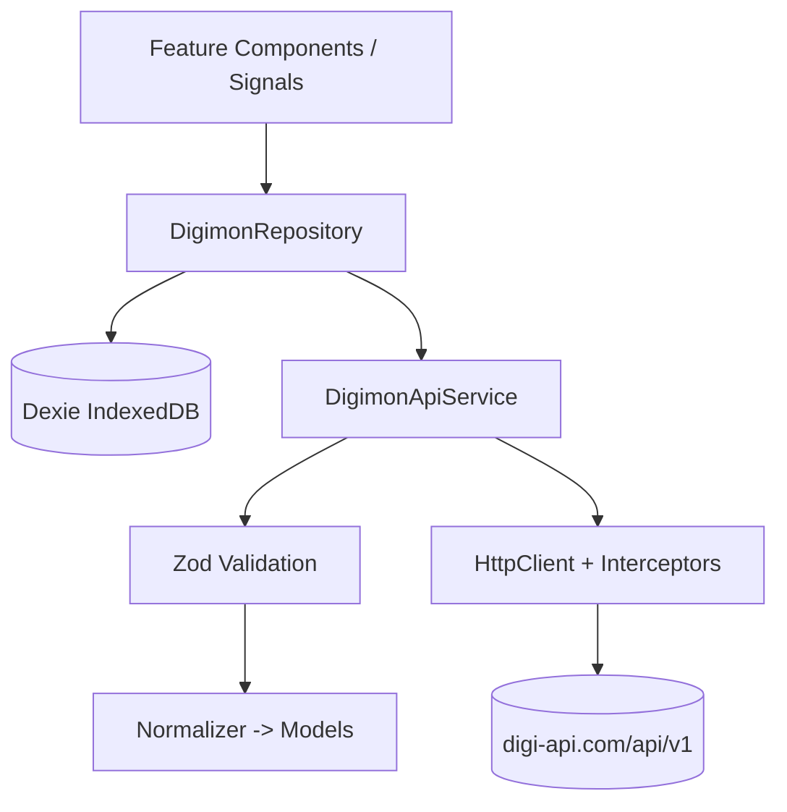

# 02 — Architektur

## Ordnerstruktur

```text
src/
  app/
    core/
      api/            # DigimonApiService, HTTP-Aufrufe, URL-Building
      cache/          # Dexie DB, Cache-Strategien
      config/         # API-Base-URL, Konstanten, Tokens
      guards/
      interceptors/   # Base-URL, Error, Retry, Loading
      models/         # TS-Interfaces (normalisiert)
      repositories/   # DigimonRepository (Cache + API + Dedup)
      services/       # SettingsService, CollectionService, ...
      utils/          # Seed/RNG, Pagination-Helper, Mapper
    design-system/
      components/      # DigiButton, DigiCard, DigiChip, ...
      tokens/          # _tokens.scss (re-export der globalen Tokens)
      animations/      # wiederverwendbare Angular-Animations
    features/
      home/ digidex/ digimon-detail/ evolution-lab/ team-builder/
      arena/ tournaments/ random-battle/ collection/ field-explorer/
      skill-library/ compare/ settings/
    game/
      battle-engine/  # reine Logik, kein UI
      stats/          # deterministische Stat-Ableitung
      phaser/ pixi/ three/   # nur lazy
      balancing/ simulations/
    shared/
      pipes/ directives/ components/ validators/
    layout/
      shell/ mobile-nav/ desktop-sidebar/ topbar/
  assets/
    icons/ sounds/ textures/ backgrounds/ placeholders/
docs/
  api-samples/ game-design/ design-system/
```

> Angular-22-Konvention: Dateien ohne `.component`-Suffix (`home.ts`, `home.html`, `home.scss`).

## Layering & Datenfluss



Regeln:
- **Komponenten** kennen nur **Repository** + Domain-Services, nie HttpClient direkt.
- **Repository** kapselt Cache-First-Strategie, Request-Deduplication, Pagination.
- **Api-Service** macht rohe Requests, validiert via Zod, normalisiert in Models.
- **Game-Logik** (Stats, Battle) ist rein und deterministisch, ohne Angular-Abhängigkeit → leicht testbar.

## State-Strategie

- UI-State: Angular **Signals** (`signal`, `computed`, `effect`), zoneless.
- Server-State: Repository hält `signal`-Caches je Ressource + Dexie-Persistenz.
- Persistenter User-State (Favorites/Teams/History): `CollectionService` → Dexie.
- Settings: `SettingsService` → Signal + `localStorage`.

## Routing

Alle Feature-Routes **lazy** via `loadComponent`. Heavy-Game-Module zusätzlich `@defer`.

| Route | View |
| --- | --- |
| `/` | Home / Dashboard |
| `/dex` | DigiDex Liste |
| `/dex/:id` | Digimon Detail |
| `/evolution-lab` | Evolution Graph Explorer |
| `/team-builder` | Team Builder |
| `/arena` | Arena Hub |
| `/arena/battle` | Battle Simulator |
| `/random-battle` | Random Battle Generator |
| `/tournaments` | Tournament Mode |
| `/fields` | Field Explorer |
| `/skills` | Skill Library |
| `/compare` | Compare Digimon |
| `/collection` | Favorites / Collection |
| `/settings` | Theme, Motion, Data Cache |
| `**` | NotFound / Redirect zu `/` |

### Navigation
- **Mobile:** Bottom-Nav mit 5 Punkten — Home, Dex, Arena, Team, More.
- **Desktop:** Sidebar links, Content-Grid, optional rechte Info-Spalte.

## Performance-Architektur
- Lazy Loading für alle Feature-Routes.
- `@defer` für Game-Libraries (Pixi/Phaser/Three) und schwere Visuals.
- Virtual Scroll (CDK) im DigiDex.
- Cache-First Repository mit Request-Dedup.
- Bild-Lazy-Loading, `NgOptimizedImage` wo sinnvoll.
- Performance-Budgets aus `angular.json` ernst nehmen.
